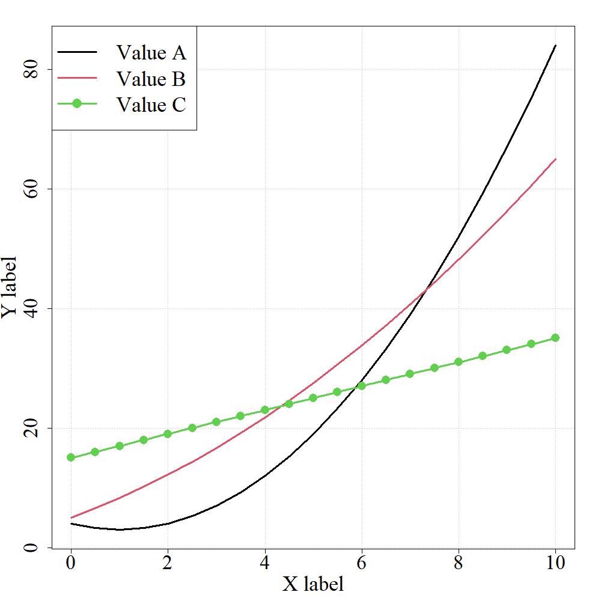
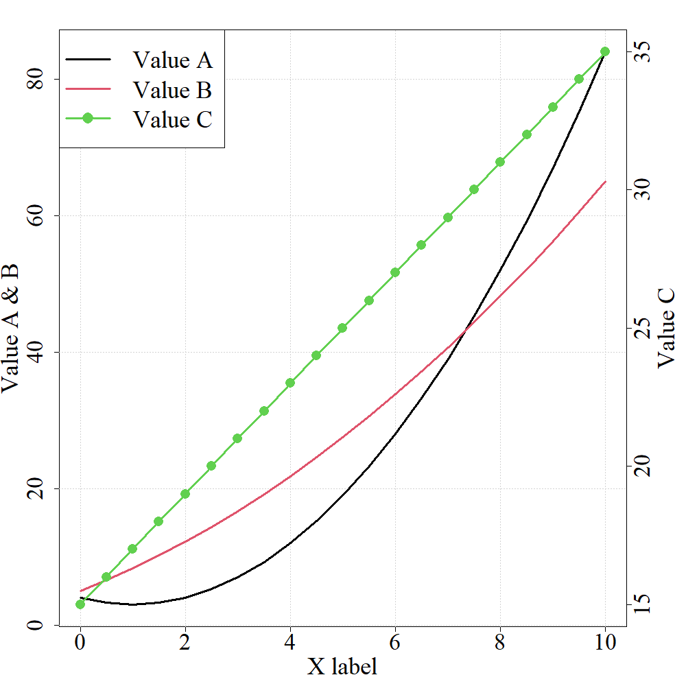
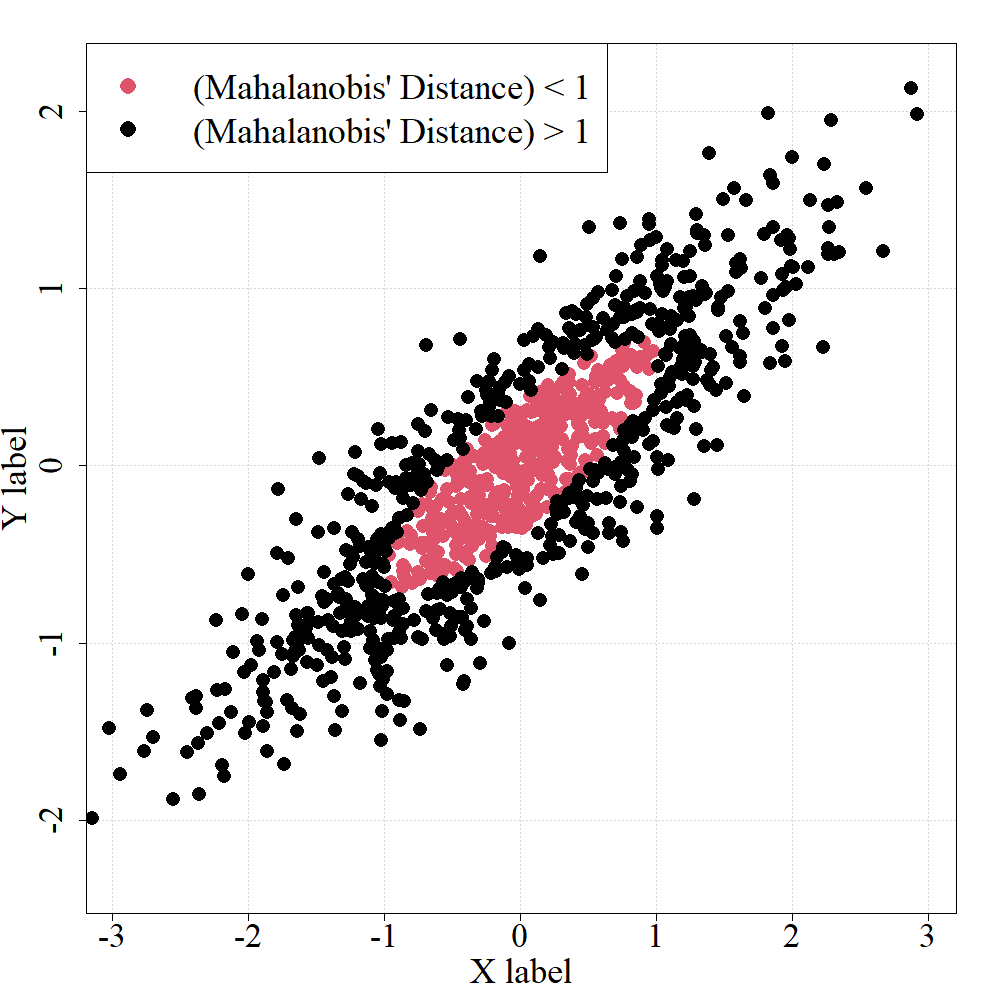
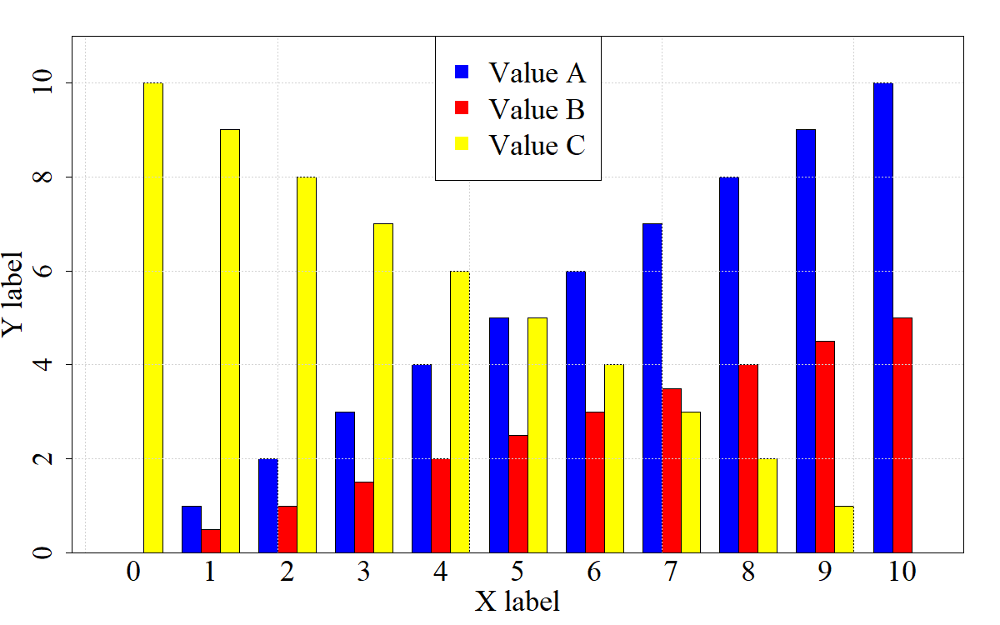
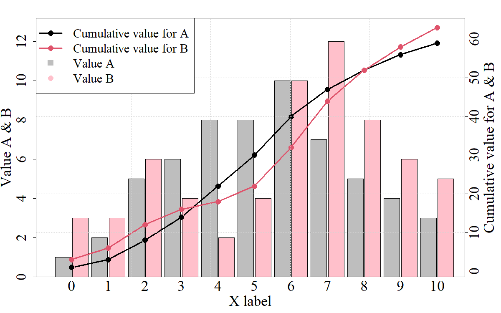
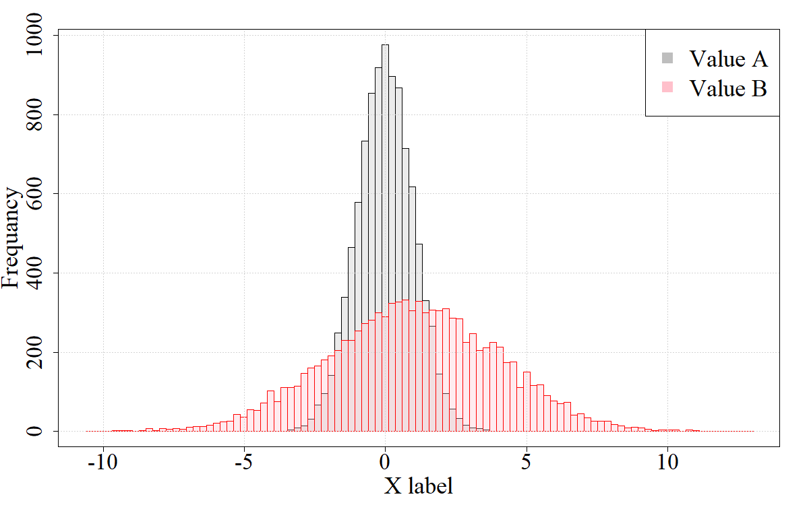
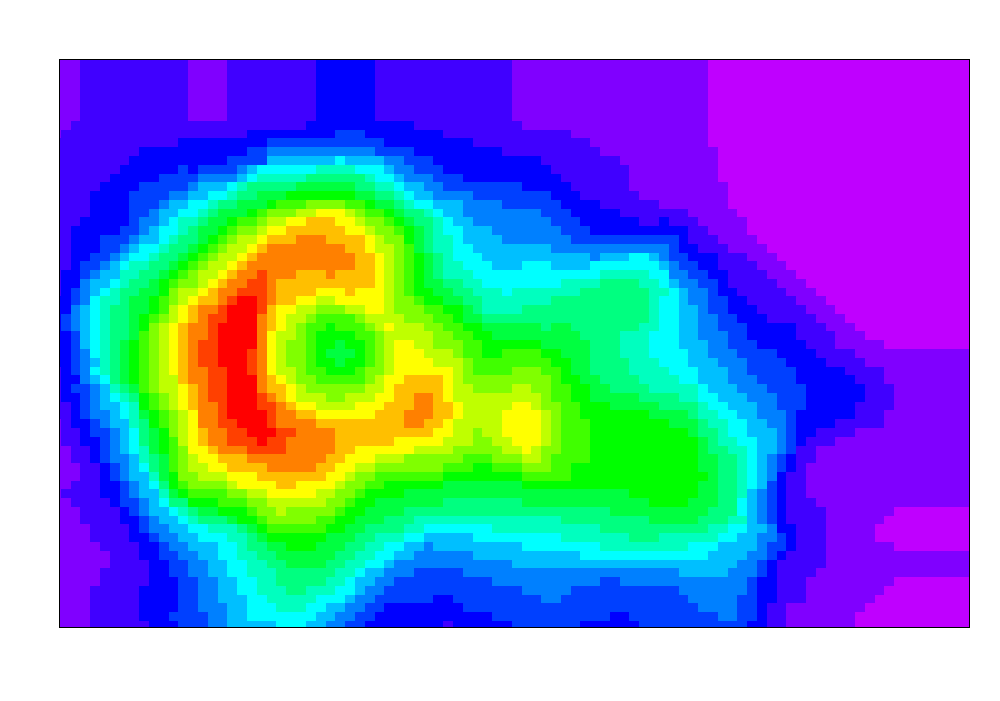
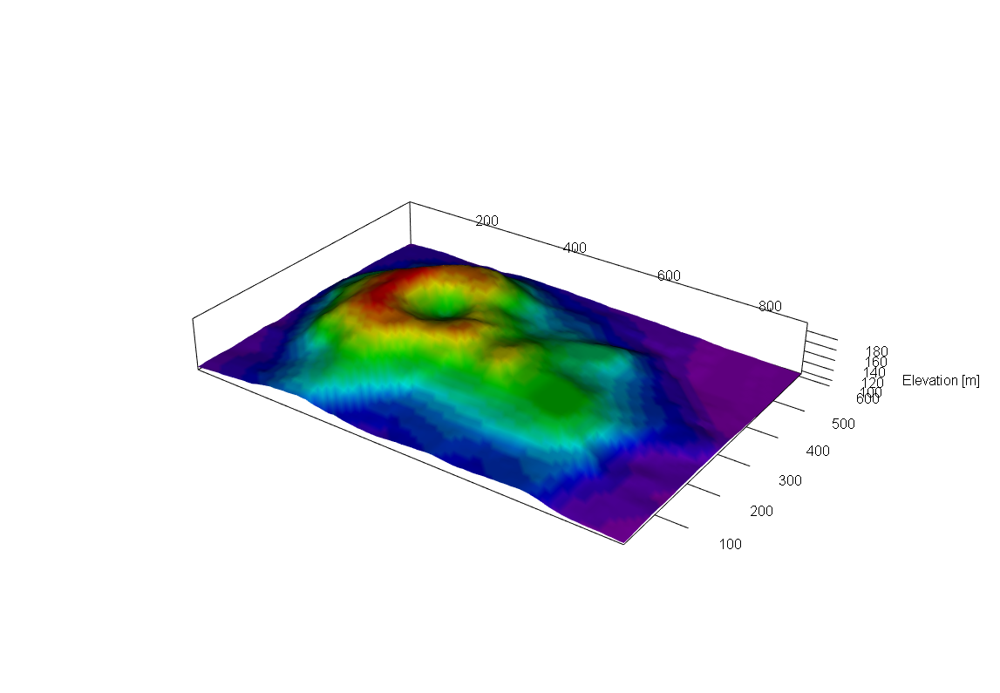

# R graph

Rでグラフを作成するためのコード集．

## 作成できるグラフ一覧
 - 折れ線グラフ・散布図 : graph.R
 - 2軸グラフ : graph.R
 - 棒グラフ : barplot.R
 - 線グラフと棒グラフの重ね合わせ：line-bar.R
 - ヒストグラム：hist.R
 - 2D・3Dコンター図：2D3D-map.R

## データの形式
 - プロットするデータについては，read.table()やread.csv()などを用いて予め読み込んでおく．
 - ndata : グラフの本数．
 
## 折れ線グラフ・散布図
 - Set individually のところで設定する．
 - 折れ線グラフや散布図では，1つのグラフ毎に，xの値をxiにyの値をyiにベクトルとして格納しておく．(i=1,...,ndata(作成するグラフ数)) 

- ほとんどプロットパラメータはデフォルトとして設定されているため，必要に応じて変更する．
 - それ以外で個別に設定しておくものは以下の通り．

 | 変数名     | 説明　　                        　　           　　　　　　　　　　　　    |    
 | :--------: | :-----------------------------------------------                           |    
 | fname      | アウトプットするファイル名     　　                                        |    
 | p.ratio    | プロット領域の比率(横に対する)                                         　　|   
 | f.legend   | 凡例の有無(あり：T，なし：F)    　                                       　| 
 | legend     | 凡例                                                                   　　|
 | p.leg      | 凡例の位置("top" or "bottom" + "left" or "right"の組み合わせまたは座標で)  |
 | xlab       | x軸のラベル　　　　            　　                                        |
 | ylab       | y軸のラベル　　　　            　　                                        |
 | axis2      | T : 2軸グラフを出力, F : 出力しない                                        |  
 | naxis      | (2軸のみ)各データがどちらの軸を参照するか(1 or 2の並ぶベクトルで)          |
 | ylab2      | (2軸のみ)2軸目のラベル　　　　　　　　　　　　　                           |

 - その他のプロットパラメータを変更する場合はその下に個別に書いておく．(具体的なものは以下の通り)
 - 複数のグラフを書くときには，それぞれグラフ数分のベクトルとして定義する．
 - (デフォルトはこのコード内でのデフォルトであり，Rのデフォルトとは異なっている．)

 | パラメータ | 説明                                                                                  |     
 | :--------: | :------------------------------------------                                           |    
 | type       | グラフのタイプ (p:点プロット(散布図)，l:線プロット(デフォルト)，b:点と線のプロット)   |    
 | lty        | 線分の形式 (1:実線(デフォルト)，2以降で点線などになる)                                |    
 | lwd        | 線分の太さ (デフォルト:3.0)                                                           |    
 | pch        | プロットのマーカー (デフォルト:なし(NA))，1:〇, 16:●など，詳細は参考ページ参照)      |    
 | clr        | 色の指定 (デフォルトは1:黒，2:赤，3:緑，4:青，5:水色，6:紫，7:黄，8:灰)               |    
 | cex        | プロットのサイズ (デフォルト2.5)                                                      |     
 | font       | ラベルなどのフォント (デフォルトはTimes New Roman)                                    |    
 | cex.lab    | ラベルのサイズ (デフォルトは3.0)                                                      |    
 | cex.axis   | 軸の数字のサイズ (デフォルトは2.8)                                                    |    
 | f.grid     | 背景の格子を書くかどうか (T:書く(デフォルト)，F:書かない)                             |    
 | cex.leg    | 凡例の文字のサイズ (デフォルト3.0)                                                    |    
 | logxy      | log軸にするかどうか(しない:""(デフォルト), x軸のみ:"x",y軸のみ:"y",両方:"xy")         |    
 | xlim,ylim  | x, yの値の範囲 (デフォルトでは各データの最小値最大値)                                 |    

### プロットの例

 - 折れ線グラフ

 - 2軸グラフ

 - 散布図

## 棒グラフ
 - da にデータを格納する
 - 複数のデータを横並びで表示させる場合には，各データを行方向に並べる形で da に格納する．
 - Set individually のところでパラメータを設定する．
 - ほとんどプロットパラメータはデフォルトとして設定されているため，必要に応じて変更する．
 - それ以外で個別に設定しておくものは以下の通り．

 | 変数名     | 説明　　                        　　           　　　　　　　　　　　　    |    
 | :--------: | :-----------------------------------------------                           |    
 | fname      | アウトプットするファイル名     　　                                        |    
 | p.ratio    | プロット領域の比率(横に対する)                                         　　|   
 | names.arg  | x軸の各項目の名前                                                      　　|   
 | f.legend   | 凡例の有無(あり：T，なし：F)    　                                       　| 
 | legend     | 凡例                                                                   　　|
 | p.leg      | 凡例の位置("top" or "bottom" + "left" or "right"の組み合わせまたは座標で)  |
 | xlab       | x軸のラベル　　　　            　　                                        |
 | ylab       | y軸のラベル　　　　            　　                                        |

 - その他のパラメータについては以下の通り．(ほとんどは折れ線グラフと同じため，異なっているもののみを示す)
 - 変更する場合については，その下に追記する．

 | パラメータ | 説明                                                           |     
 | :--------: | :------------------------------------------                    |    
 | f.box      | グラフ領域を箱で囲むか．(T:囲む(デフォルト)，F:囲まない)       |    

### プロットの例
 - 複数データを並べた棒グラフ

 

## 線グラフと棒グラフの重ね合わせ
 - データの格納方法については，それぞれ上記のものと同様．
 - ただし，xの値については，データ間で共通としておく必要がある．
 - 1軸目に棒グラフ，2軸目に折れ線グラフの値がくるような形になる．
 - パラメータについては，上記のものと同じであるが，折れ線と棒グラフで分けるものについては，1,2をつけて区別する．(1:線グラフ，2:棒グラフ)

 - 線グラフ・棒グラフそれぞれで設定するパラメータ

 | 変数名           | 説明　　                      　　         　　　    |    
 | :-------------:  | :-----------------------------------------------     |    
 | ndata1, ndata2   | プロットするデータ数   　　                          |    
 | clr1, clr2       | プロットの色    　　                                 |    
 | ylab1, ylab2     | y軸の1軸，2軸目のラベル                          　　|   
 | ylim1, ylim2     | y軸の1軸，2軸目の値の範囲                        　　|   
 | legend1, legend2 | 線グラフ，棒グラフの凡例    　                     　| 

### プロットの例

## ヒストグラム
 - x1(, x2, ...)にデータを格納する．(複数の場合は重ね書き)
 - プロットパラメータについては，先述のものと同じ．
 - freqを設定することで，頻度・密度で出力を変更することが可能．
 - ylim, ylabは，freqの設定から自動で設定される．

 - ヒストグラムで設定するパラメータ

 | 変数名           | 説明　　                      　　         　　　    |    
 | :-------------:  | :-----------------------------------------------     |    
 | freq             | T：頻度表示，F：密度表示 (デフォルト: T)             |    
 | nbreak           | 棒グラフ(x軸)の分割数 (デフォルト: 100)              |    
 | border           | 棒グラフの枠線の色 (個別で設定)                      |    

### プロットの例

## 2D・3Dコンター図
 - 3次元マップを出力する際には，予め"rgl"パッケージをインストールする必要がある．
 - x座標，y座標の値をベクトルでxx,yyに格納，標高を(x軸のデータ数)×(y軸のデータ数)でzzに格納する．(このプログラムは，データが格子状に並んでいる場合のみ動作する．)
 - evにカラーコンターとして出力する値を入れる．データはzzと同じ次元にする．(デフォルトでは標高値となっている)
 - 色は，clr.cにベクトルの形で入れる．(clr.cが1要素しか持たない場合には，単色の3次元マップのみが出力される．)
 - ワーキングディレクトリ内に"pv.txt"というファイルを置くことで，3次元plotの角度が自動で調節される．(作成方法については後述)
 - カラーバーは別ファイルとして出力される形になっている．

### プロットの例

 - rglで画面状に出力される図は，回転・拡大縮小等を自由に行うことができる．

### pv.txtの作成方法
1 一度3次元コンター図をrglで出力する．   
2 rglによって出力された図を，回転・拡大縮小等で見やすいように調整する．    
3 プログラムの最下部にあるコメントアウトされた2行を実行する．     
 
pv.tvtを一度作成しておくことで，毎回の調整が不要になり，同じ視点からの図を複数作成することができる．     

